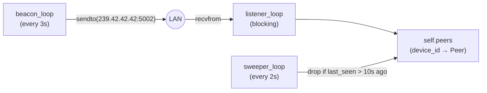
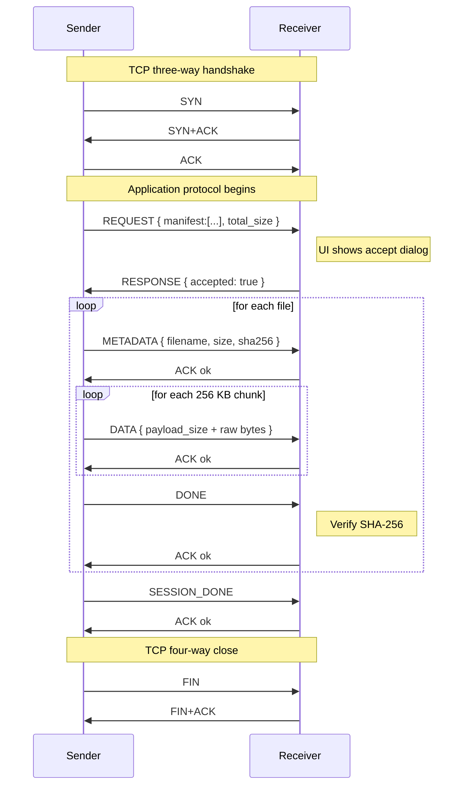
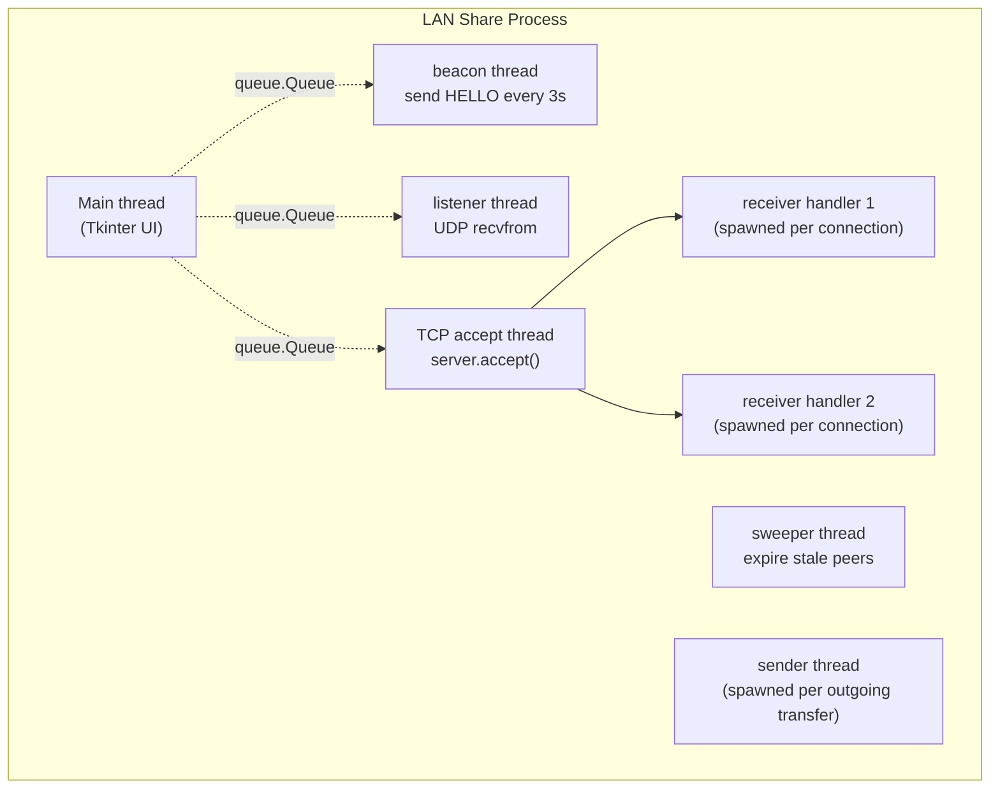

# Networking Architecture — LAN Share

This document explains the project from a **networking perspective**, mapping every piece of code to the textbook concept it implements. Read it alongside [protocol.py](protocol.py), [discovery.py](discovery.py), and [transfer.py](transfer.py).

---

## 1. The OSI / TCP-IP layers used

```
┌────────────────────────────────────────────────────────┐
│ Application layer  │ JSON-framed protocol (our code)    │
├────────────────────┼────────────────────────────────────┤
│ Transport layer    │ TCP   (file transfer)              │
│                    │ UDP   (device discovery)           │
├────────────────────┼────────────────────────────────────┤
│ Network layer      │ IP                                 │
├────────────────────┼────────────────────────────────────┤
│ Link layer         │ Ethernet / Wi-Fi (handled by OS)   │
└────────────────────┴────────────────────────────────────┘
```

We write code at the **Application layer**. The OS handles everything below.

---

## 2. Why two transport protocols?

| Concern | Discovery | File transfer |
|---|---|---|
| Recipient known in advance? | No | Yes (chosen from peer list) |
| Reliability needed? | No (next HELLO replaces lost ones) | Yes — every byte must arrive |
| Ordering needed? | No | Yes — chunk N before chunk N+1 |
| Connection setup OK? | No (connection-less, no handshake) | Yes (3-way handshake is fine once) |
| **Choice** | **UDP** | **TCP** |

This is the classic textbook split: **UDP for announcements, TCP for streams.**

---

## 3. Discovery: UDP multicast

### Why multicast (239.42.42.42), not broadcast (255.255.255.255)?

UDP broadcast is the textbook example, and it works on most LANs. We use **multicast** for one practical reason: **on Windows, when two processes on the same machine both bind UDP port 5002, only one receives broadcasted packets** — broadcast delivery is undefined when multiple sockets share a port. Multicast delivery, in contrast, is **duplicated to every socket that has joined the group**, so two processes on the same PC reliably discover each other.

Multicast group `239.42.42.42` is in the **locally-scoped administrative range** (`239.0.0.0/8`, see [RFC 2365](https://tools.ietf.org/html/rfc2365)). With **TTL=1** the packets travel exactly one hop — never crossing routers, staying on the local LAN.

### The three threads inside `Discovery` ([discovery.py](discovery.py))



### The `HELLO` packet (one UDP datagram)

```json
{
  "type":      "HELLO",
  "device_id": "5f3c7b...",      // stable per-machine UUID
  "name":      "Ahmad-Laptop",   // friendly name shown in UI
  "tcp_port":  5001,             // where to TCP-connect to send files
  "version":   2
}
```

### Key socket calls (with line references)

**Sender side** ([discovery.py](discovery.py) `_make_sender`):
```python
s = socket.socket(AF_INET, SOCK_DGRAM)              # UDP socket
s.setsockopt(IPPROTO_IP, IP_MULTICAST_TTL, 1)       # local LAN only
s.setsockopt(IPPROTO_IP, IP_MULTICAST_LOOP, 1)      # see our own packets
s.sendto(packet, ("239.42.42.42", 5002))            # ← send the datagram
```

**Receiver side** ([discovery.py](discovery.py) `_make_listener`):
```python
s = socket.socket(AF_INET, SOCK_DGRAM)
s.setsockopt(SOL_SOCKET, SO_REUSEADDR, 1)           # share port with siblings
s.bind(("", 5002))                                  # listen on all interfaces
mreq = struct.pack("4sl", inet_aton("239.42.42.42"), INADDR_ANY)
s.setsockopt(IPPROTO_IP, IP_ADD_MEMBERSHIP, mreq)   # ← join multicast group
data, addr = s.recvfrom(4096)                        # ← receive datagram
```

`IP_ADD_MEMBERSHIP` tells the kernel: "I want to receive packets sent to multicast group X on any interface." Without it, the kernel filters multicast packets out.

### Peer expiry (TTL)

Peers have a `last_seen` timestamp. The `sweeper_loop` runs every 2 seconds and removes entries older than `PEER_TTL=10` seconds. So when a laptop closes its lid, everyone notices within 10 seconds — even though no `BYE` was sent.

---

## 4. File transfer: TCP

### Why we still need application-layer logic on top of TCP

TCP gives us:
- **Reliability** — retransmission, error correction at packet level
- **Ordering** — bytes arrive in order
- **Flow control** — sender slows down when receiver is full
- **Congestion control** — backs off when network is busy

TCP does **not** give us:
- Message boundaries — TCP is a **byte stream**, not a message stream
- Application-level structure — what does each byte mean?
- End-to-end integrity — TCP's checksum is only 16 bits per segment, can be defeated by a hash collision or corruption after the kernel hands data over

So our application layer adds:

1. **Message framing** ([protocol.py](protocol.py)) — `4-byte length` + `JSON header` + optional `binary payload`
2. **Typed messages** — `REQUEST`, `RESPONSE`, `METADATA`, `DATA`, `ACK`, `DONE`, …
3. **A handshake** — `REQUEST`/`RESPONSE` so the user can accept or reject
4. **Per-chunk ACKs** — fine-grained progress + early failure detection
5. **End-to-end SHA-256** — catches every kind of corruption, including disk errors

### The full session timeline



### Key socket calls

**Sender** ([transfer.py](transfer.py) `send_files`):
```python
sock = socket.socket(AF_INET, SOCK_STREAM)         # TCP socket
sock.connect((host, port))                          # ← TCP three-way handshake
send_msg(sock, REQUEST, manifest=..., ...)          # send JSON-framed message
resp = recv_msg(sock)                               # block until RESPONSE arrives
for chunk in iter_chunks(file):
    send_msg(sock, DATA, payload=chunk, ...)        # send one DATA message
    ack = recv_msg(sock)                            # wait for ACK
sock.close()                                        # ← FIN, TCP four-way close
```

**Receiver** ([transfer.py](transfer.py) `serve_forever`):
```python
server = socket.socket(AF_INET, SOCK_STREAM)
server.bind(("", 5001))                             # INADDR_ANY: all interfaces
server.listen(8)                                    # backlog: queued half-open conns
while True:
    conn, addr = server.accept()                     # ← block until client connects
    threading.Thread(target=handle, args=(conn,)).start()
```

`bind("", 5001)` uses `INADDR_ANY` (`0.0.0.0`) so we accept connections on **any** local interface (Wi-Fi, Ethernet, loopback). `listen(8)` sets the kernel's accept backlog — up to 8 pending connections can wait while we're busy.

### Why per-chunk ACK?

Without per-chunk ACK, the sender would happily push 100 MB into the kernel's TCP send buffer, then think it's "done" — even if the receiver crashed after byte 1. Per-chunk ACK is round-trip-bound, so the sender knows after each 256 KB whether the receiver is still alive and writing to disk successfully. It also gives smooth UI progress (1 chunk = 1 progress update).

The trade-off: **throughput drops**. A single round-trip-time (RTT) per chunk caps speed. On a 1ms-RTT LAN with 256 KB chunks, the upper bound is ~250 MB/s — fine for our use case. On a 50ms-RTT WAN it would be ~5 MB/s, which is why production protocols (HTTP/2, gRPC, BitTorrent) **pipeline** multiple chunks before waiting for ACKs.

### Why end-to-end SHA-256?

Because **TCP's 16-bit checksum can be defeated**. Some real failure modes:
- A faulty NIC corrupts bytes after TCP checksum verification
- The kernel writes correctly to disk, but the disk has a bad sector
- Memory corruption between socket buffer and `f.write()`

SHA-256 is computed by the **sender** before transmission and verified by the **receiver** after writing to disk. If a single bit differs anywhere along the entire path, the digest changes and we delete the corrupted file. This is the "end-to-end argument in system design" (Saltzer, Reed, Clark — 1984).

---

## 5. Concurrency model

The app uses **OS threads**, not async I/O, because socket programming with threads is the textbook model and easier to reason about for a course discussion.



### Thread safety

Tkinter is **not** thread-safe — only the main thread may touch widgets. Every other thread sends events to the UI through `queue.Queue`. The UI calls `self.after(50, self._poll_queue)` to drain the queue from the main thread on a 50 ms timer.

---

## 6. Reliability summary

| Failure mode | What catches it |
|---|---|
| Single bit flip in a TCP segment | TCP checksum (16-bit) |
| Lost TCP segment | TCP retransmission |
| Out-of-order TCP segments | TCP reassembly buffer |
| Connection drop mid-transfer | `recv()` returns 0 → `ConnectionError` raised → UI shows error |
| Receiver disk full / file write fails | Exception in `_handle_connection` → ERROR sent → sender aborts |
| Bit corruption *outside* the TCP stack (NIC, RAM, disk) | **Application-level SHA-256** at end of each file |
| Receiver rejects the transfer | `RESPONSE { accepted: false }` |
| Sender or receiver crashes | TCP RST → other side gets `ConnectionResetError` |
| Discovery packet lost | Next HELLO replaces it (every 3 s) |
| Peer goes offline | Peer entry expires after 10 s of silence |

---

## 7. What you can demonstrate live

| Question the prof might ask | Demo / answer |
|---|---|
| "Show me the TCP three-way handshake" | Wireshark filter: `tcp.port == 5001` while clicking Send. Three packets: SYN, SYN+ACK, ACK |
| "Show me the application-layer messages" | Wireshark "Follow TCP Stream" — you can see the JSON headers in cleartext |
| "What if you remove SHA-256?" | Comment out the verification block → flip a bit in a received file → silently corrupted, sender thinks it succeeded |
| "What if you use UDP for transfer?" | Would need to implement reliability (sequence numbers, retransmission, ordering) — i.e. reinvent TCP poorly |
| "Why multicast not broadcast?" | Two processes on the same Windows machine sharing UDP port 5002 — multicast delivers to both, broadcast doesn't |
| "How does discovery survive packet loss?" | Each HELLO is independent; the next one (3 s later) re-announces. TTL=10 s gives 3 chances before a peer expires |
| "What's the security model?" | Receiver shows a dialog with the file list before any DATA is sent. Currently no encryption — could add TLS via `ssl.wrap_socket()` in ~5 lines |

---

## 8. Suggested talking points

1. **"We chose TCP for transfer because we need ordering, reliability, and flow control — these are exactly what TCP provides for free, and reimplementing them on UDP would mean writing a worse TCP."**

2. **"We chose UDP for discovery because it's connectionless. We don't know who the peers are yet, and we don't need reliability — if a HELLO is lost, the next one (3 seconds later) will replace it."**

3. **"TCP gives us a byte stream, not a message stream. Our framing layer (4-byte length prefix + JSON header) recovers message boundaries — without it, `recv()` would return arbitrary fragments."**

4. **"Per-chunk ACK gives us application-layer flow visibility. TCP's flow control happens between kernels; our ACK happens between processes, so we know the receiver actually wrote the chunk to disk."**

5. **"End-to-end integrity needs end-to-end checks. TCP's 16-bit checksum protects only the network path. SHA-256 over the whole file protects against everything — including bugs in our own code."**

6. **"Multicast is a network-layer feature implemented by IGMP. We join group 239.42.42.42 with `IP_ADD_MEMBERSHIP`, the kernel sends an IGMP report, and the local switch starts forwarding multicast frames to our interface. TTL=1 keeps us on the LAN."**
